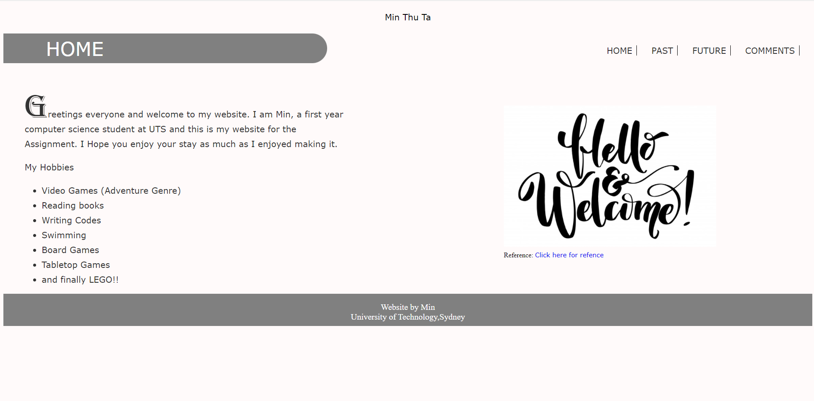
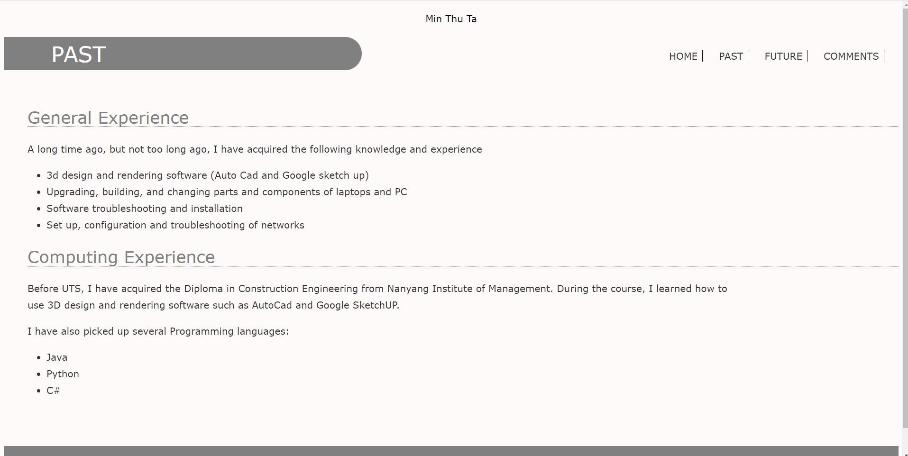
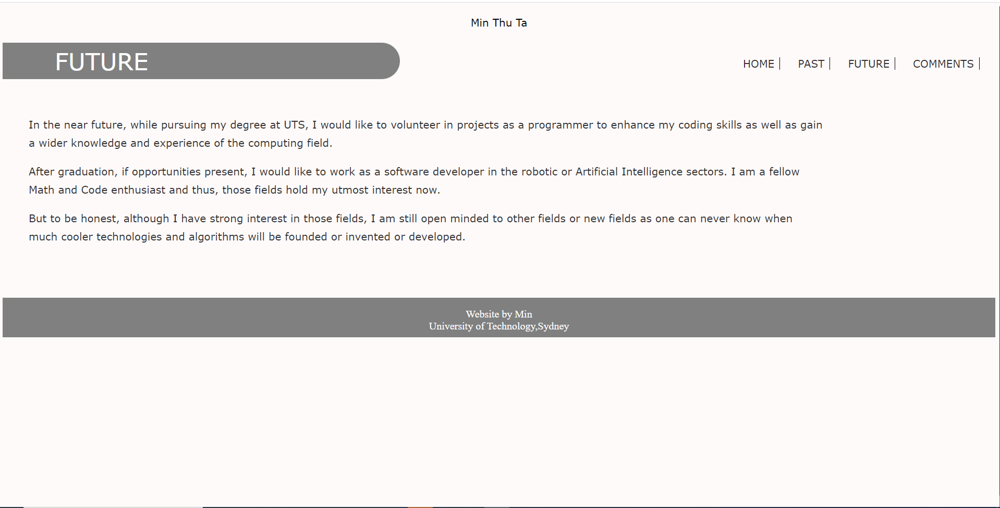
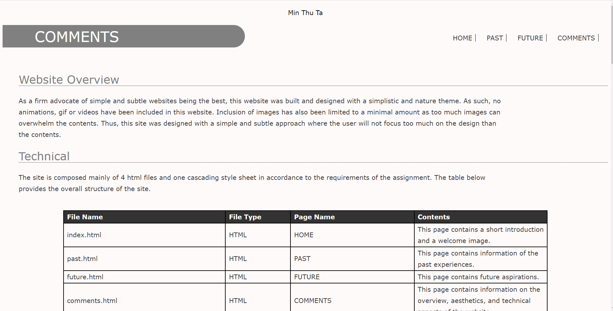

# personalwebsite
----
Hello there stranger! Welcome to my little corner of the internet.
This is a personal mock portfolio website I developed during my first year of Unversity.
The website itself was simply built with pure HTML5 and CSS.
It contains 4 pages.

